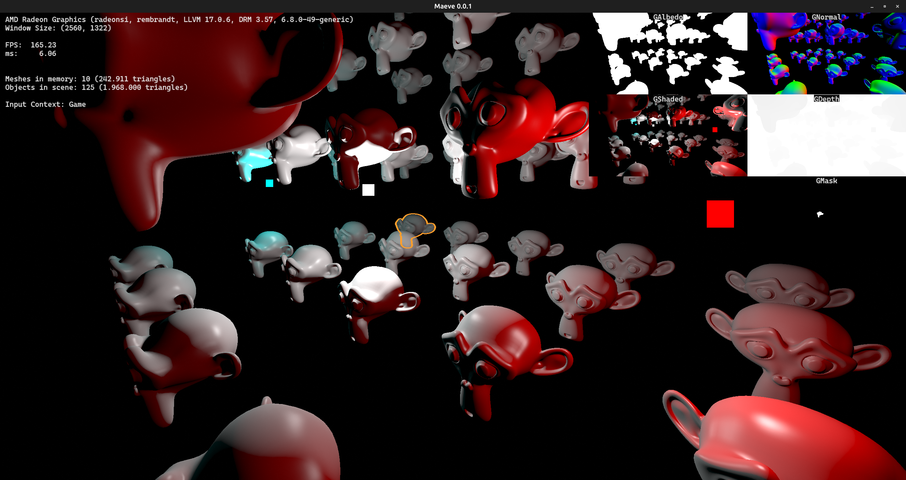
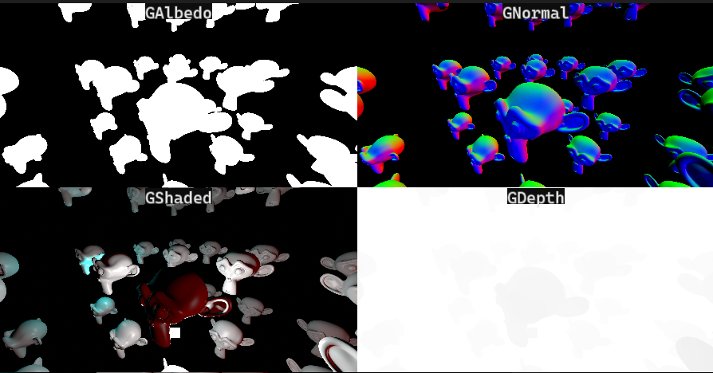
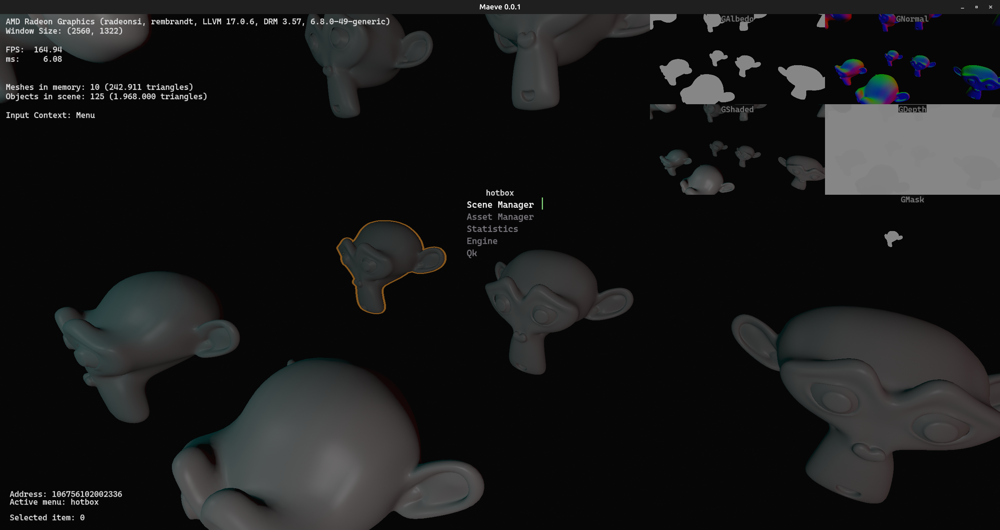
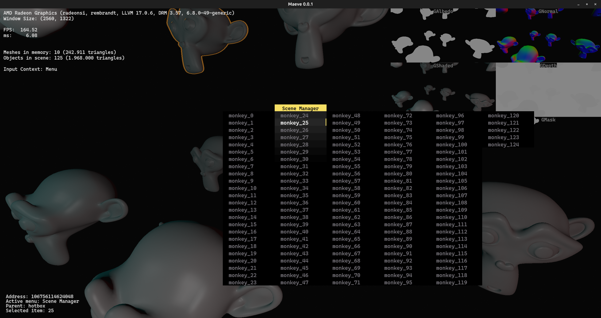
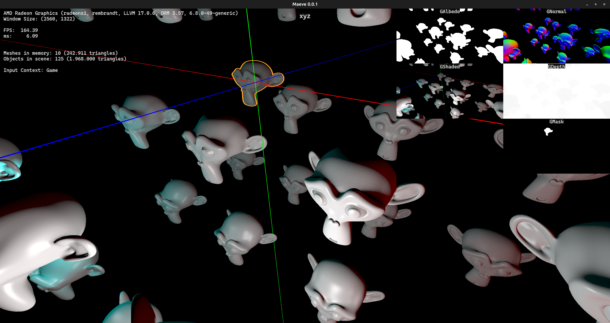

# Maeve
Custom game engine hobby project
Makefile is made for linux and uses shared libraries (freetype2), won't work on windows, yet
### Features
* Deferred phong shading (position reconstruction from depth) & OBJ file parsing

* Text rendering and custom UI interface

* Viewport transformations (WIP)

